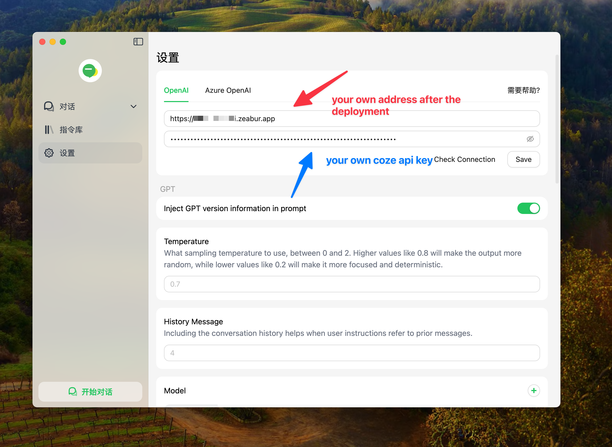

# C2O
[English](README.md) · **中文** 

**在您喜爱的 OpenAI 客户端上使用 Coze.**

该项目将 Coze API 转换为 OpenAI API 格式，使您可以在您喜爱的 OpenAI 客户端中访问 [Coze](https://www.coze.com) 的LLMs、知识库、插件和工作流程.

# 功能
- 支持 Coze API 转换为 OpenAI API 格式
- 支持流式、非流式输出
- 支持多机器人快速切换

# 准备工作
1. 在 [coze.com](https://www.coze.com)或 [coze.cn](https://www.coze.cn)注册并获取您的 API 令牌


2. 创建您的机器人并发布到 API


3. 获取机器人的 ID，即机器人参数后面的数字，并将其配置为环境变量
```bash
https://www.coze.com/space/73428668341****/bot/73428668*****
```

# 部署
## Zeabur
[](https://zeabur.com/templates/BZ515Z?referralCode=fatwang2)

## Vercel
[](https://vercel.com/new/clone?repository-url=https://github.com/fatwang2/coze2openai&env=BOT_ID&envDescription=COZE_BOT_ID)

**注意:** Vercel 的无服务器函数有 10 秒的超时限制

## Railway
[](https://railway.app/template/yM5tQL?referralCode=mDim7U)

## Docker部署

1. 确保您的机器上安装了Docker和Docker Compose。

2. 克隆项目仓库：
   ```
   git clone https://github.com/your-username/coze2openai.git
   cd coze2openai
   ```

3. 创建并配置`.env`文件：
   ```
   cp .env.template .env
   ```
   编辑`.env`文件，填入您的BOT_ID和其他必要的配置。

4. 构建并启动Docker容器：
   ```
   docker-compose up -d
   ```

5. 访问`http://localhost:3000`来确认服务是否正常运行。

要停止服务，运行：
```
docker-compose down
```

注意：Dockerfile中使用了淘宝NPM镜像源，你可以注释掉或替换其他源：
```Dockerfile
# RUN npm config set registry https://registry.npmmirror.com
# RUN pnpm config set registry https://registry.npmmirror.com
```

# 本地部署
1. 首先把`.env.template`文件复制改名为`.env`

2. 在 .env 文件上设置环境变量
```bash
BOT_ID=xxxx
```

3. 安装依赖项
```bash
pnpm install
```

4.运行项目
```bash
pnpm start
```

# 用法
1. OpenAI 三方客户端



2. 代码里直接调用

```JavaScript
const response = await fetch('http://localhost:3000/v1/chat/completions', {
  method: 'POST',
  headers: {
    'Content-Type': 'application/json',
    'Authorization': 'Bearer YOUR_COZE_API_KEY',
  },
  body: JSON.stringify({
    model: 'model_name',
    messages: [
      { role: 'system', content: 'You are a helpful assistant.' },
      { role: 'user', content: 'Hello, how are you?' },
    ],
  }),
});

const data = await response.json();
console.log(data);
```
# 环境变量
该项目提供了一些额外的配置项，通过环境变量设置：

| 环境变量 | 必须的 | 描述                                                                                                                                                               | 例子                                                                                                              |
| -------------------- | -------- | ------------------------------------------------------------------------------------------------------------------------------------------------------------------------- | -------------------------------------------------------------------------------------------------------------------- |
| `BOT_ID`     | Yes      | 机器人的 ID。从 Coze 中机器人的开发页面 URL 获取它。 bot参数后面的数字是bot id.| `73428668*****`|
| `BOT_CONFIG`     | No      | 配置模型和机器人ID的对应关系，实现在客户端切换模型来调用不同的机器人的效果。如果调用不在配置文件的模型，则走默认的BOT_ID| `{"model_name_1": "bot_id_1", "model_name_2": "bot_id_2", "model_name_3": "bot_id_3"}`|
| `COZE_API_BASE`     | No      | 选择coze.com或者coze.cn| `api.coze.com, api.coze.cn`|


# 路线图
**即将推出**
*   图像支持
*   音频转文字
*   文本转语音

**现在可用**
*   支持 coze.cn
*   多机器人切换
*   连续对话，有对话历史
*   Zeabur＆Vercel&Railway 部署
*   流式和非流式传输
*   Workflow、插件、知识库
*   Docker 部署

# 联系
如有任何问题或反馈，请随时联系

[X](https://sum4all.site/twitter)\
[telegram](https://sum4all.site/telegram)

<a href="https://www.buymeacoffee.com/fatwang2" target="_blank"></a>

# 许可证
该项目在 MIT 许可证下获得许可.
